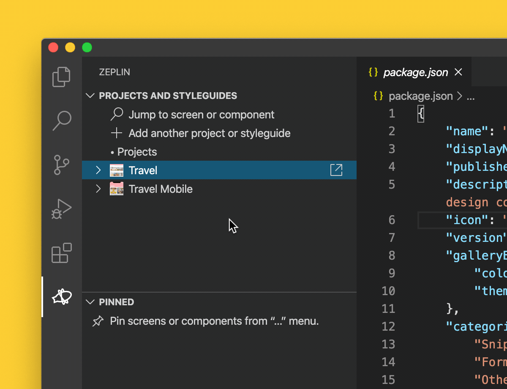

# Zeplin Visual Studio Code Extension

Visual Studio Code extension for Zeplin 🔌

## Installation

[Download](https://marketplace.visualstudio.com/items?itemName=zeplin.zeplin) Zeplin from Visual
Studio Code extension marketplace

## Usage

### Connected Components

[Connected Components](https://blog.zeplin.io/introducing-connected-components-components-in-design-and-code-in-harmony-aa894ed5bd95) in Zeplin lets you access components in your codebase directly on designs in Zeplin, with links to Storybook, GitHub and any other source of documentation based on your workflow. 🧩

Zeplin's Visual Studio Code extension makes it easier to create the JSON configuration file that connects components in your codebase to their design counterparts in Zeplin.

☝️ *Note that using Visual Studio Code and the extension is optional and the JSON configuration file can always be created manually in any text editor.*

Once you open a workspace in Visual Studio Code, Zeplin extension will take you through creating the Zeplin configuration file for Connected Components:

1. Create Zeplin Configuration File
2. Login to Zeplin
3. Add Project to Zeplin Configuration
4. Add Styleguide to Zeplin Configuration
5. Add Component to Zeplin Configuration
6. Connect Zeplin Component to a Component in Configuration

    ☝️ *You can connect multiple Zeplin components to one component in configuration.*

All these steps can either be:

- Run as a command, default shortcut is “Command/Ctrl + Shift + P”.
- Run by clicking Code Lens/Hover links in the configuration file.

## Contributing and Issue Tracking

See [CONTRIBUTING.md](./CONTRIBUTING.md) for details.

## Roadmap

### Improvements

- [ ] Ignore files in ignore files (e.g. `.gitignore`) while adding components
- [ ] Shorten component paths while adding components
- [ ] Validate token format during login
- [ ] Online validation for project ids, styleguide ids, component Zeplin names
- [ ] Add shortcuts to commands

### New features

- [ ] Allow selecting multiple components while adding them
- [ ] Add commands for adding base URLs
